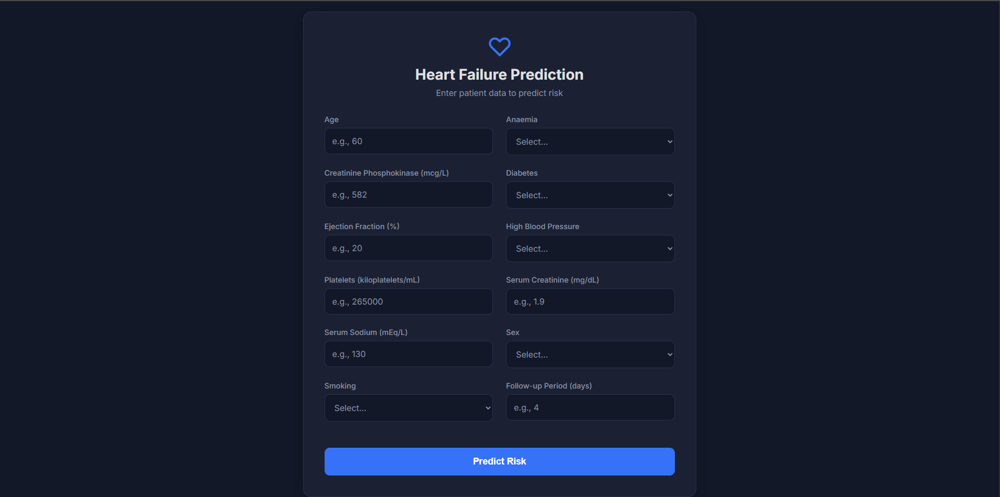
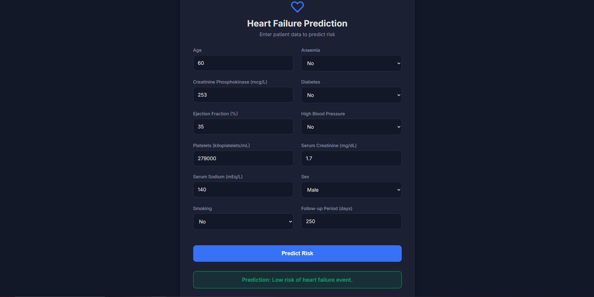
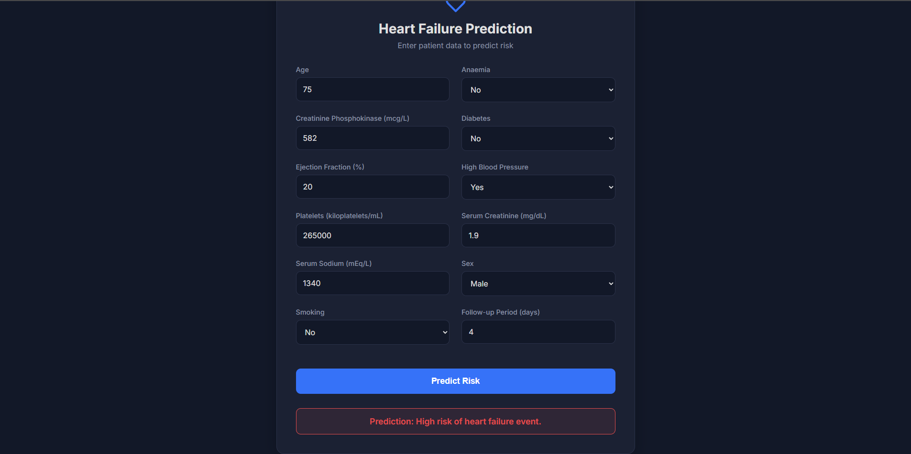

# Heart Failure Prediction Web Application

This project is a machine learning-based web application that predicts the risk of heart failure in patients based on their clinical records. The predictive model is deployed using the **Flask** web framework.

> **Project Created For:**  
> **Predictive Modelling Bootcamp by DevTown**

---

## Application Interface



---

## Features

- **Predictive Model:** Uses a tuned `RandomForestClassifier` with an accuracy of **83.33%`.
- **Interactive UI:** Clean, responsive, and dark-themed user interface for inputting patient data.
- **Flask Backend:** Lightweight Python backend to serve the model and process predictions.

---

## Sample Outputs

|  |  |
| :----------------------------------------: | :----------------------------------------: |
| **Low Risk Prediction**                    | **High Risk Prediction**                    |

---

## Tech Stack

- **Backend:** Python, Flask  
- **Machine Learning:** Pandas, Scikit-learn, NumPy  
- **Frontend:** HTML, CSS  

---

## How to Run the Project Locally

Follow these steps to set up and run the project on your local machine:  

### 1️⃣ Clone the Repository
```bash
git clone https://github.com/Vasu-uu/Heart-Failure-Prediction.git
cd Heart-Failure-Prediction
```

### 2️⃣ Create and Activate a Virtual Environment

**For macOS/Linux:**
```bash
python3 -m venv venv
source venv/bin/activate
```

**For Windows:**
```bash
python -m venv venv
.env\Scriptsctivate
```

### 3️⃣ Install Dependencies
```bash
pip install -r requirements.txt
```

### 4️⃣ Run the Flask Application
```bash
python app.py
```

### 5️⃣ Access the Application
Open your browser and go to:  
[http://127.0.0.1:5000](http://127.0.0.1:5000)

You should now see the application running and ready for predictions.

---

## Author

**Vasudev V**  
[GitHub - Vasu-uu](https://github.com/Vasu-uu)
